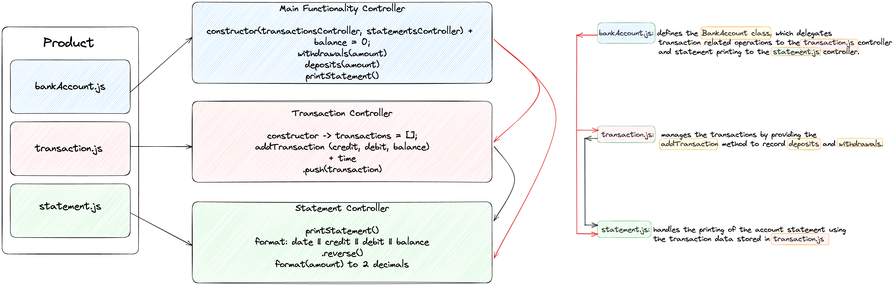

# Bank_Tech_Test README

## Table of Contents

[1. Specifications](#1-specifications)  
[2. Observations](#2-observations)  
[3. User Story](#3-user-story)  
[4. Diagram](#4-diagram)  
[5. Methodology Implementaion](#5-methodology-implementation)  
[6. Tickets](#6-tickets)  
[7. Test Covarage](#7-test-covarage)  
[8. Screenshots](#8-screenshots)  
[9. Instructions](#9-instructions)  
[10. Self assessment citeria](#10-self-assement)  

## 1. Specifications

### Bank tech test

Today, you'll practice doing a tech test.

For most tech tests, you'll essentially have unlimited time.  This practice session is about producing the best code you can when there is a minimal time pressure.

You'll get to practice your OO design and TDD skills.

You'll work alone, and you'll also review your own code so you can practice reflecting on and improving your own work.

### Specification

#### Requirements

* You should be able to interact with your code via a REPL like IRB or Node.  (You don't need to implement a command line interface that takes input from STDIN.)
* Deposits, withdrawal.
* Account statement (date, amount, balance) printing.
* Data can be kept in memory (it doesn't need to be stored to a database or anything).

#### Acceptance criteria

**Given** a client makes a deposit of 1000 on 10-01-2023  
**And** a deposit of 2000 on 13-01-2023  
**And** a withdrawal of 500 on 14-01-2023  
**When** she prints her bank statement  
**Then** she would see

```
date || credit || debit || balance
14/01/2023 || || 500.00 || 2500.00
13/01/2023 || 2000.00 || || 3000.00
10/01/2023 || 1000.00 || || 1000.00
```

## 2. Observations

* The date in the spcification is for example purposes only, therefore when the program is run it will display the current date.

* The program will follow the STATEMENT specifications and:
  * use .00 or 2 decimals after the main number;
  * format the date as per speicfications DD/MM/YYYY;
  * use 2 pipe characters || to seperate each column;
  * if either the debit or credit amount is missing, this will be replaced by 2 pipe characters ||;
  * statement will display in reverse chronological order, starting with the latest transaction.

* The program will take into account if any withdrawls will cause the balance to become negative and display an error of 'Insufficient funds'.

## 3. User Story

```
1. As a user, I would like to deposit money into my account.
2. As a user, I would like to withdraw money from my account.
3. As a user, I would like to request the printing of my account statement that shows me the date, amount and balance.
4. As a user I would like my statement to have a header. 
5. As a user, I would like to see my latest transaction first when printing my statement.
```

## 4. Diagram



## 5. Methodology Implementation

### SRP vs SOC

Research was conducted on both SOC (separation of concerns principles) and SRP (single responsability principles) to determine the most effcicient, stable and easy to maintain solution. Due to the requirements and low complexity of the program, it was determined that both principles would overlap in terms of code structure and organization and would not look significantly different - if at all. Both principles focus on modularity, maintainability and testability by separating concerns.

For more information on SOC, click [here](https://help.sap.com/doc/abapdocu_753_index_htm/7.53/en-US/abenseperation_concerns_guidl.htm#:~:text=Separation%20of%20concerns%20is%20a,and%20arrangement%20in%20software%20layers.).

For more information on SRC, click [here](https://en.wikipedia.org/wiki/Single-responsibility_principle).

For perspectives on the differences between SRP and SOC, you can view this article [here](https://www.petrosefthymiou.com/post/the-single-concern-vs-the-single-responsibility-principles), a second article [here](https://www.cloudnativemaster.com/post/single-responsibility-and-separation-of-concerns) and another [here](https://beyond-agility.com/what-is-the-difference-between-soc-and-srp/).

### Controller functionality

1. **BankAccount Controller**: handles the overall functionality of the program acting as the main interface, handling operations such as withdrawals, deposits and printing statements; delegates transaction related operations to the transaction controller and statement printing to the statement controller.

2. **Transaction Controller**: manages, records and stores all transactions associated with the bank account class/controller and provides the user with additional information such as the transaction date, credit and debit amount, and resulting balance.

3. **Statement Controller**: generates and prints the account statement in the desired format based on the stored transactions found in the transaction controller.

### Testing

1. **BankAccount Controller Tests**: 

* deposits (passed):
  * add 1000, expect balance to be 1000;
  * add 1000, add 1000 and expect balance to be 2000;

* withdrawals (developing):
  * add 2000, draw 1000 and expect balance to be 1000;
  * add 2000, draw 1000, draw 500 and expect balance to be 500;


2. **Transaction Controller Tests**: tbc

3. **Statement Controller Tests**: tbc

## 6. Tickets

1. Develop Folder Structure. ==Done==
2. Install nvm, istanbul, setup jest and istanbul. ==Done==
3. Develop tests for deposit. -> In Porgress
4. Develop tests for withdrawal. -> Not Starter
5.
6.
7.
8.
9.
10.


## 7. Test Covarage

## 8. Screenshots

## 9. Instructions

### Running JavaScript

#### Introduction

This program uses Javascript, a dynamic computer programming language and one of the core technologies for developing web page content, alongside HTML and CSS.

For this exercise to be run, a program called Node.js will have to be installed. Node.js is a JavaScript runtime, i.e. it reads JavaScript code and executes it as a programs

<ins> Step 1: Clone this repo to your machine:

```
# Create a folder/directory where you would like to store the cloned repo: 
$ mkdir cloned-repo

# Then switch to the newly created directory:
$ cd cloned-repo

# Inside the new fodler clone the repo, command which will copy all the existing files from the Git repository:
$ git clone link-to-git-repository

```

<ins> Step 2: Install nvm

Nvm stands for Node Version Manager, a tool that allows you to install and swtich in between different versions of Node.
NVM is distributed using github - you can find installation instructions for the latest version [here](https://github.com/nvm-sh/nvm#installing-and-updating).

```
# You'll need to run a command that looks like this:
curl -o- https://raw.githubusercontent.com/nvm-sh/nvm/v0.39.1/install.sh | bash

# Once that step is complete, reload your ~/.zshrc file:
source ~/.zshrc

# Now you can install Node by running: 
$ nvm install node
```

<ins> Step 3: Setting up the project

```
# When NVM is installed, once can automatically install and use the latest, stable version. You can set up the enviroment by running: 
$ nvm use node

#The next step would be to set up the folder structure, however this is not required as this has been already done. 

# Initialize NPM project, i.e. create the package.json file: 
$ npm init -y

# Add the jest package to run tests in the tests directory:
$ npm add jest

```

<ins> Step 4: Running tests:

```
# Please check that all tests are running in the test directory before running the program in REPL: 
$ jest

# To see test coverage then run: 
$ test
```

<ins> Step 5: Running the program/app in REPL:

```
# Run node to open the node REPL:
$ node

# Require the class within the file:
$

# Create a new instance of the class, i.e. create a new bank accout: 
$

# Deposit the desired amount: 
$

# Withdraw the desired amount: 
$

# Print statement: 
$
```

## 10. Self-assement

### Questions and Answers

Normal Cnstraints:

```
1. Did you start a feature test?
Yes/No/I don't know

2. Do the tests pass?
Yes/No/I don't know

3. Is the test coverage high? (>95%)
Yes/No/I don't know

4. Do the unit tests mock the dependencies of the object they are testing?
Yes/No/I don't know
```

Additional Constraints:

```
5. Where possible, do you always test for the behaviour rather than the state? 
Yes/No/I don't know

6. Do the test descriptions read clearly?
Yes/No/I don't know

7. Do you make appropriate use of the testing framework's method to keep your test code clean? 
Yes/No/I don't know
```

Strict Constraints:

```
8. Does your project commit history clearly show evidence of a thorough TDD process?
Yes/No/I don't know

9. Have you mocked the dependecy Time?
Yes/No/I don't know

10. Personal perception of the quality of testing (scale of 1-4):
1, 2, 3, 4
```

Once you have completed the challenge and feel happy with your solution, here's a form to help you reflect on the quality of your code: <https://docs.google.com/forms/d/1Q-NnqVObbGLDHxlvbUfeAC7yBCf3eCjTmz6GOqC9Aeo/edit>

<!-- BEGIN GENERATED SECTION DO NOT EDIT -->

---

**How was this resource?**  
[😫](https://airtable.com/shrUJ3t7KLMqVRFKR?prefill_Repository=makersacademy/course&prefill_File=individual_challenges/bank_tech_test.md&prefill_Sentiment=😫) [😕](https://airtable.com/shrUJ3t7KLMqVRFKR?prefill_Repository=makersacademy/course&prefill_File=individual_challenges/bank_tech_test.md&prefill_Sentiment=😕) [😐](https://airtable.com/shrUJ3t7KLMqVRFKR?prefill_Repository=makersacademy/course&prefill_File=individual_challenges/bank_tech_test.md&prefill_Sentiment=😐) [🙂](https://airtable.com/shrUJ3t7KLMqVRFKR?prefill_Repository=makersacademy/course&prefill_File=individual_challenges/bank_tech_test.md&prefill_Sentiment=🙂) [😀](https://airtable.com/shrUJ3t7KLMqVRFKR?prefill_Repository=makersacademy/course&prefill_File=individual_challenges/bank_tech_test.md&prefill_Sentiment=😀)  
Click an emoji to tell us.

<!-- END GENERATED SECTION DO NOT EDIT -->